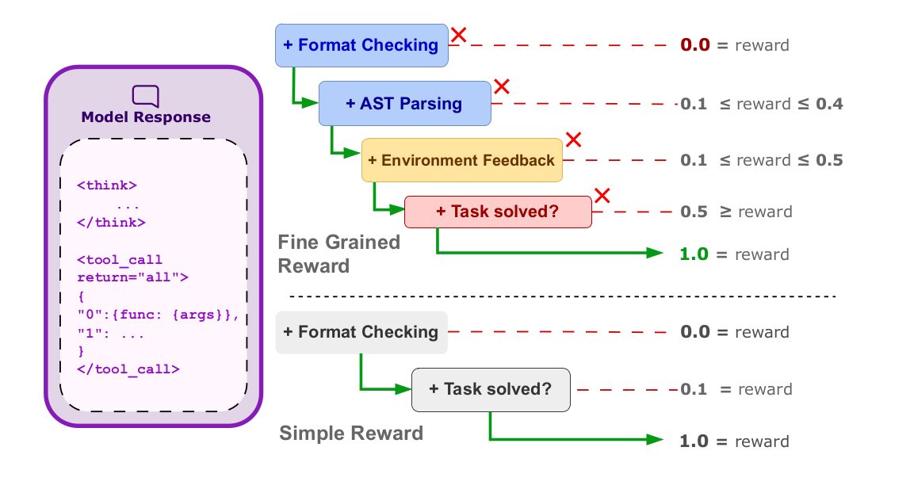

# TIER: Trajectory-Invariant Execution Rewards for Multi-Step Tool Composition

> NeurIPS 2026 submission. Preprint PDF: [`docs/paper.pdf`](docs/paper.pdf).

TIER is a reinforcement-learning recipe that teaches language models to compose multiple API calls into a correct chain — without having to memorise any single "ground-truth" trajectory. The reward decomposes into four components evaluated against the **executable** environment, not against a reference solution:

TIER reward is computed once per generated tool-call sequence as

$$
R_{\text{total}} = R_{\text{format}} + R_{\text{parse}} + R_{\text{exec}} + R_{\text{answer}}, \quad \text{with } R_{\text{total}} \text{ scaled to } [0, 1]
$$

Each component verifies a distinct property of the full sequence—syntactic, structural, operational, and semantic—and is computed without reference to ground-truth trajectories. We represent tool sequences as structured ASTs that expose call ordering, argument bindings, and any nesting structure.

**Format Validity.** $R_{\text{format}} \in \\{0,1\\}$ checks whether the full AST is well-formed and parsable. If this fails, all downstream rewards are zero.

**Schema Adherence (Parsing).** Decomposes as

$$
R_{\text{parse}} = R_{name} + R_{param} + R_{dtype}, \quad R_{\text{parse}} \in [0,3]
$$

reflecting three granularities of schema correctness. Tool names are checked categorically

$$
R_{name} =
\begin{cases}
1 & \text{if all tool names are valid} \\
0 & \text{otherwise}
\end{cases}
$$

since name validity determines which schema each call is checked against, any invalid API makes the sequence unverifiable and by extension invalid ($R_{\text{parse}} = 0$). Parameter and type correctness are graded by mismatch counts,

$$
R_{param/dtype} = \text{clip}(1 - \lambda_p \cdot p, 0, 1),
$$

where $p$ is the total number of mismatches across all calls in the sequence, each call's parameters checked against its own schema. We set $\lambda_p = 0.25$, balancing two failure modes: too large a coefficient eliminates partial credit for nearly-correct schemas, while too small a coefficient makes individual mismatches negligible.

Because every component is computed by replaying the model's *own* generated trajectory against a simulated environment, TIER is **trajectory-invariant**: any of the many valid solutions for a query is rewarded equally, removing the bias that ground-truth-anchored rewards introduce when a query admits multiple correct tool compositions.

We pair this reward with **DepthBench**, an executable benchmark of 1,710 multi-step tool-use queries stratified by depth (0–6) over 163 hand-built APIs. Training Qwen3-8B on DepthBench with the full TIER reward improves end-task accuracy on DepthBench, BFCL, and NestFUL over outcome-only, ground-truth-supervised (ToolRL), and SFT baselines — and avoids the reward-hacking failure mode that arises when the parsing signal is removed.

---

## Pipeline at a glance



---

## Repository layout

```
TIER/
├── README.md                 LICENSE  CITATION.cff
├── pyproject.toml            requirements.txt  requirements-cuda.txt
├── install.sh
├── docs/paper.pdf            Submitted manuscript.
├── data/                     DepthBench, SFT, ToolACE, xLAM corpora.
│   ├── depthbench/{full,filtered_n5,filtered_n10,filtered_n20}.json
│   ├── sft/sft_dataset.json
│   ├── toolace/{rl_dataset, function_definitions}.json + toolace_apis/
│   └── xlam/{rl_dataset, function_definitions}.json + xlam_apis/
├── configs/                  accelerate.yaml, deepspeed.json
├── scripts/                  Paper-aligned train/eval entry scripts.
└── src/tier/                 Installable package.
    ├── environment/          DepthBench simulator + API base class.
    ├── data/                 Dataset loader + prompt builder.
    ├── parsing/              AST parser + schema validator.
    ├── rewards/              TIER reward + ablations + ToolRL baseline.
    ├── prompts/              Instruction templates + tool schemas.
    ├── sampling/             vLLM sampling defaults.
    ├── training/             Argparser, model loader, trainer.
    ├── evaluation/           Batched evaluator.
    └── cli/                  ``tier-train`` and ``tier-eval`` entry points.
```

---

## Quickstart

```bash
git clone <repo-url> tier && cd tier

conda create -n tier python=3.12 -y
conda activate tier

bash install.sh                 # editable install + CUDA stack (Blackwell / cu128)
# or: bash install.sh --no-cuda  # skip vLLM / flash-attn / flashinfer

bash scripts/train_tier.sh
bash scripts/eval_tier.sh
```

The default model is Qwen3-8B; override with `TIER_MODEL=...`. All scripts write outputs to `outputs/<run_name>/` and tee logs to `outputs/<run_name>/{train,eval}.log`.

**Hardware note.** The reference setup is 2 × Blackwell-class GPUs with CUDA 12.8 (`TORCH_CUDA_ARCH_LIST=12.0`). On Hopper or earlier export `TORCH_CUDA_ARCH_LIST=9.0` (or appropriate) before launch. Adjust `num_processes` in `configs/accelerate.yaml` for other GPU counts.

---

## Reproducing the paper

| Paper result                              | Script                            | Reward / objective                                     |
| ----------------------------------------- | --------------------------------- | ------------------------------------------------------ |
| Table 1, "Simple" baseline                | `scripts/train_simple.sh`         | `--reward-type simple`                                 |
| Table 1, "ToolRL" baseline                | `scripts/train_toolrl.sh`         | `--reward-type tool_rl`                                |
| Table 1, "TIER" (full reward)             | `scripts/train_tier.sh`           | `--reward-type finegrained`                            |
| Table 2, "+Parsing (no Exec)" ablation    | `scripts/train_parsing.sh`        | `--reward-type finegrained_with_parsing`               |
| Table 2, "+Execution (no Parsing)"        | `scripts/train_execution.sh`      | `--reward-type finegrained_with_execution`             |
| Table 3, SFT baseline                     | `scripts/train_sft.sh`            | `--objective SFT`                                      |
| Appendix F, DAPO objective                | `scripts/train_dapo.sh`           | `--objective GRPO_DAPO`, `--reward-type finegrained`   |

Each `scripts/train_*.sh` has a matching `scripts/eval_*.sh` that walks every checkpoint produced by the training run and evaluates it on the held-out DepthBench split.

For the **Appendix E** ToolACE / xLAM transfer experiments, swap the dataset by passing `--toolace` or `--xlam` to any training script (the loaders are wired up via `tier.data.dataset_loader.DatasetManager`).

### DeepSpeed → HuggingFace checkpoint conversion

The training scripts use DeepSpeed ZeRO-3, so each `checkpoint-N/` under `outputs/<run_name>/` is sharded across optimiser/parameter dumps rather than a `from_pretrained`-loadable folder. Convert once and reuse:

```bash
tier-convert --run-name tier --checkpoint-step 500
# writes outputs/tier/checkpoint-500-hf/  (model.safetensors + tokenizer files)
```

The eval scripts also accept `--is-deepspeed` to convert on the fly, but running `tier-convert` once avoids redoing the materialisation on every evaluation.

---

## DepthBench

DepthBench (paper §3) is an executable benchmark of multi-step tool-use queries with the following properties:

- **1,710 queries** stratified by depth 0–6 (number of chained tool invocations required to resolve them).
- **163 hand-built APIs** with realistic schemas, parameter-type validation, and CSV-backed data.
- **Train / validation split**: 944 / 766 queries (the validation set removes all tools that appear in training, so model performance reflects generalisation to unseen schemas).
- **JSON dumps** in `data/depthbench/` (`full_dataset.json` for everything, `filtered_dataset_n{5,10,20}.json` for the depth-stratified subsets used in §4.4).
- **Executable backend** is `tier.environment.simulator.SimulatedAPIEnvironment`; each tool's `.execute(**kwargs)` returns an HTTP-style structured dict.

---

## Extension points

### Custom rewards

```python
# my_reward.py
def calculate_my_reward(generations, answer, tag, parser, **kwargs):
    ...
    return [scalar for _ in generations]
```

Add a routing branch to `tier.rewards.pipeline_reward_func` (and a `reward_type` value in `tier.training.argparser`), then run any training script with `--reward-type my_reward`. See `src/tier/rewards/__init__.py::create_reward_function` for the factory.

### Custom datasets

`tier.data.dataset_loader.DatasetManager` exposes hooks for plugging in a new JSON corpus. Mirror the format of `data/depthbench/full_dataset.json` (each entry has `question`, `answer`, `api_calls`, `tag`, `apis`) and pass `--dataset-path /path/to/new.json`.

### Custom tools

Subclass `tier.environment.APIBase` (or use `API_base` for back-compat with auto-generated ToolACE/xLAM modules) and add the instance as an attribute on `SimulatedAPIEnvironment`. Update `src/tier/prompts/function_definitions.json` so the model sees the new schema.

---

## Acknowledgements

- The ToolRL reward primitives in `src/tier/rewards/_toolrl_external.py` are adapted from [ToolRL (Qian et al., 2025)](https://arxiv.org/abs/2504.13958) under Apache 2.0.
- DepthBench tools borrow data tables from public CSV exports (see `src/tier/environment/api_data/`).
- ToolACE and xLAM API stubs in `data/{toolace,xlam}/` are auto-generated from their respective public function catalogues.

---

## Authors

- Anay Kulkarni\*
- ChiaEn Lu\*
- Dheeraj Mekala
- Jayanth Srinivasa
- Gaowen Liu
- Jingbo Shang

\*Equal contribution.

### Repository maintainers

- Anay Kulkarni — [ankulkarni@ucsd.edu](mailto:ankulkarni@ucsd.edu)
- ChiaEn Lu - [allenlu@ucsd.edu](mailto:allenlu@ucsd.edu)

For questions about the codebase or reproducing results, please open an issue or email the maintainers.

---

## Citation

Please cite the paper via [`CITATION.cff`](CITATION.cff).

---

## License

Released under the terms of [`LICENSE`](LICENSE).
